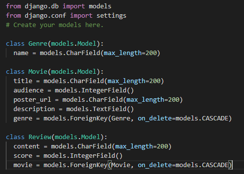
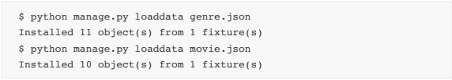
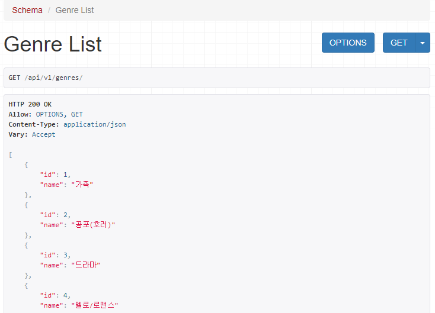
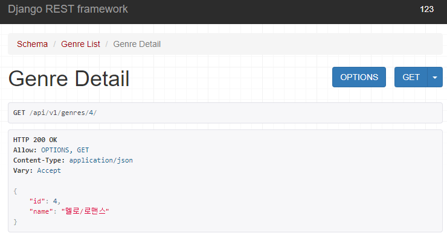
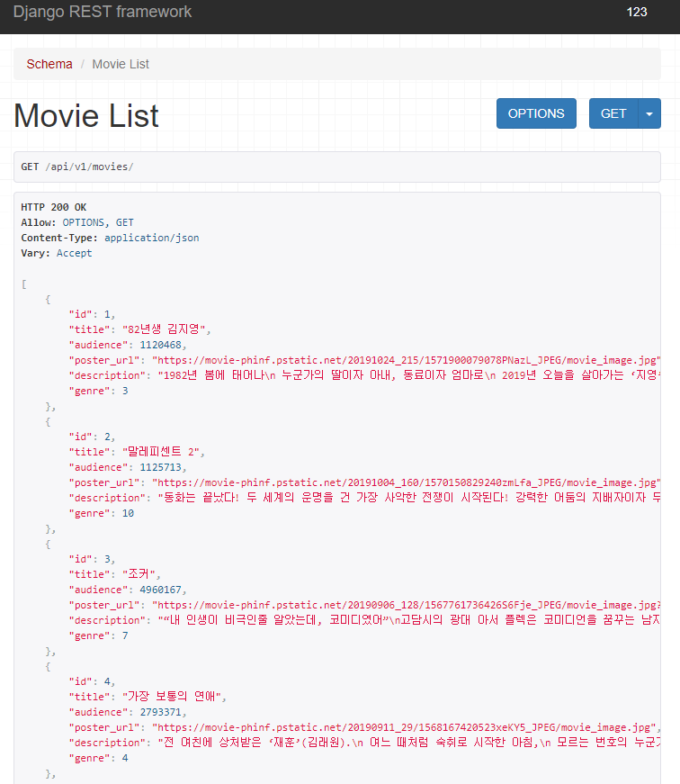
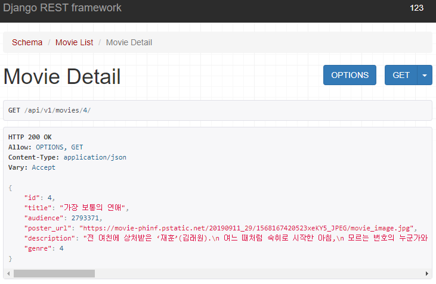
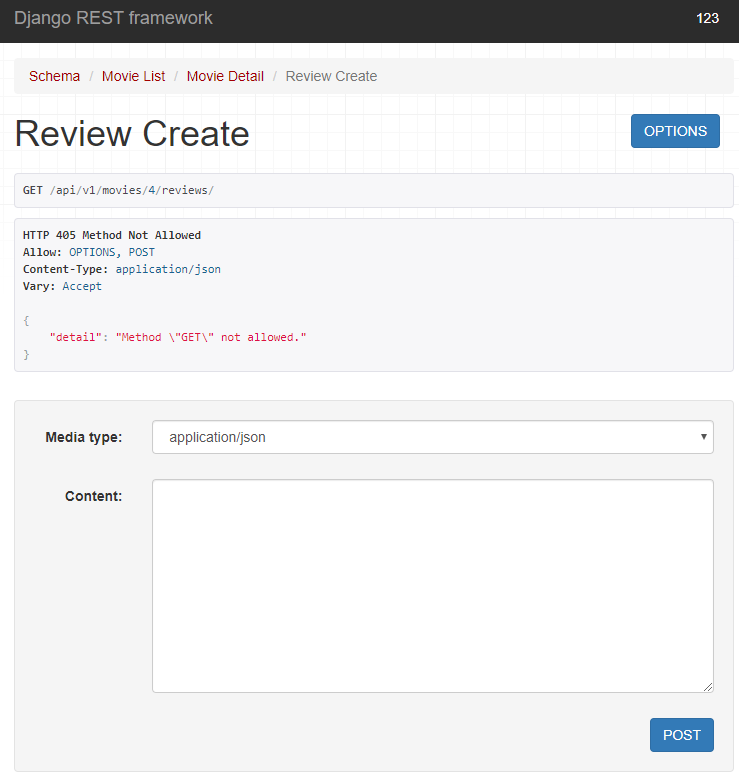
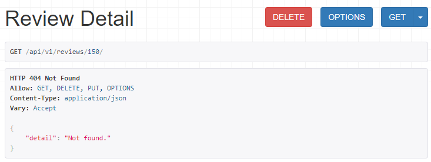
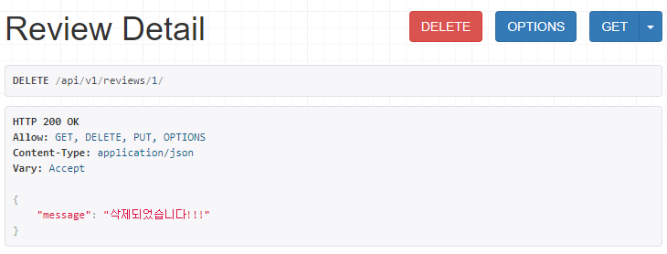
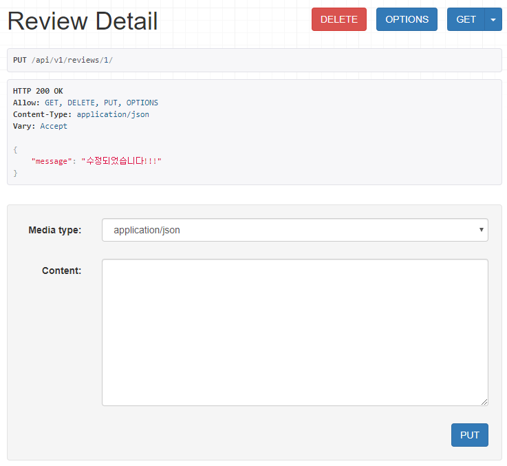

# project08

API요청을 이해하고 RESTful API 서버를 만들어보자

--------------------------------------

1. 모델 설정

   

2. Seed Data 반영

   

3. API 요청 결과

   - /api/v1/genres/

   

- /api/v1/genres/{genre_pk}/

- /api/v1/movies/

- GET /api/v1/movies/{movie_pk}/

- /api/v1/movies/{movie_pk}/reviews/

- PUT /api/v1/reviews/{review_pk}/

